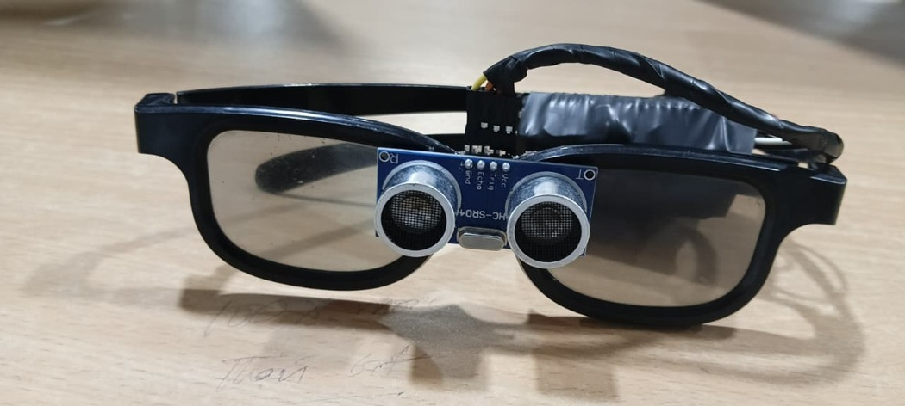

# Smart Goggles with Voice Assistant & Beep Alert

## 📌 About the Project

Smart Goggles is an IoT-based assistive system designed to help users detect obstacles while walking. The goggles use an ultrasonic sensor to detect nearby objects and provide real-time voice and beep alerts.

## 🚀 Features

- 🔹 Real-time obstacle detection
- 🔹 Voice alert: "Obstacle ahead"
- 🔹 Beep alert when an obstacle is very close
- 🔹 Lightweight and wearable design
- 🔹 ESP32-based IoT system

## 🛠️ Components Used

- ESP32
- HC-SR04 Ultrasonic Sensor
- DFPlayer Mini
- Speaker
- Piezo Buzzer
- Smart Goggles Frame

## ⚙️ How It Works

The HC-SR04 ultrasonic sensor measures the distance between the goggles and nearby obstacles. The ESP32 processes the sensor data and activates the voice or beep alert depending on the distance.

## 📸 Project Photos

### Smart Goggles

### Prototype

## 🎯 Future Improvements

- Add GPS navigation
- Add camera-based object detection
- Add mobile application connectivity
- Improve voice assistance using AI

## 👩‍💻 Technologies

ESP32 • IoT • Embedded Systems • Ultrasonic Sensor
